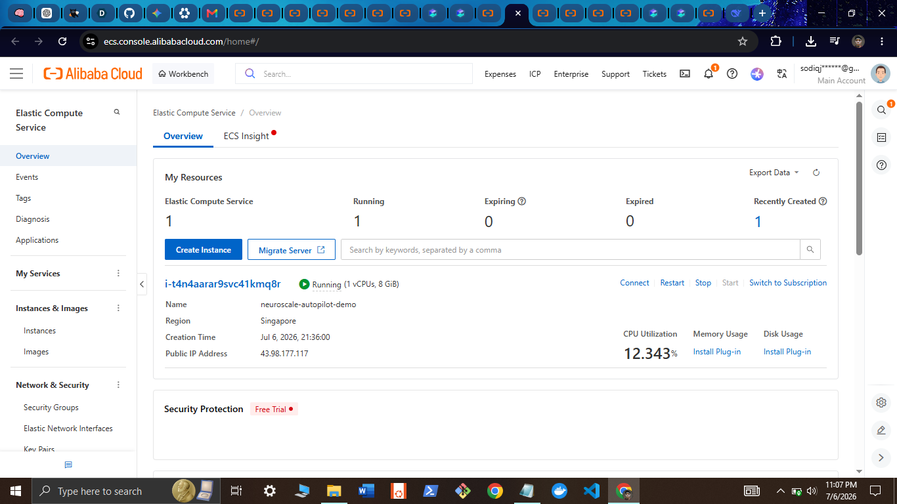

# Proof of Deployment

This document exists to directly answer the two requirements from the hackathon's "Proof of Deployment" guidance, in the same order they were given.

## 1. Code file using a Qwen Cloud API Base URL

**File:** [`agents/analyzer/analyzer.py`](agents/analyzer/analyzer.py#L66) (identical pattern also in [`agents/planner/planner.py`](agents/planner/planner.py#L61) and [`agents/escalation/escalation.py`](agents/escalation/escalation.py#L50))

```python
base_url = os.getenv("QWEN_BASE_URL", "https://dashscope-intl.aliyuncs.com/compatible-mode/v1")
self.client = AsyncOpenAI(api_key=api_key, base_url=base_url)
self.model = os.getenv("QWEN_MODEL_MAX", "qwen-max")
```

The default base URL committed in code is `https://dashscope-intl.aliyuncs.com/compatible-mode/v1` — one of the exact Base URLs listed in the hackathon's proof-of-deployment guidance.

**What the live deployment actually runs with:** the live Alibaba Cloud instance backing every screenshot in this README uses a Token Plan / workspace-scoped key instead of a plain pay-as-you-go key, so its `QWEN_BASE_URL` (set via environment variable, not committed — it is account-specific but not secret) is:

```
https://ws-xjh0d4em92lzmzzh.ap-southeast-1.maas.aliyuncs.com/compatible-mode/v1
```

This is the exact same URL family the hackathon lists for the Token Plan (`https://token-plan.ap-southeast-1.maas.aliyuncs.com/compatible-mode/v1`) — same `maas.aliyuncs.com` domain, same region (`ap-southeast-1`), same `/compatible-mode/v1` path — with the workspace ID in place of the generic `token-plan` label, which is how Alibaba Cloud Model Studio scopes workspace-specific Token Plan keys. See [`.env.example`](.env.example) for both the default and Token Plan configuration side by side, and [`docker-compose.yml`](docker-compose.yml) for how `QWEN_BASE_URL` flows into the running container.

Live, real API responses from this exact endpoint are captured in [`docs/proof/live-api-response.json`](docs/proof/live-api-response.json), and the full reasoning output is visible in the [Trust Layer decision card screenshot](docs/screenshots/trust-layer-decision-card.png).

## 2. Visual evidence — Alibaba Cloud Workbench



Screenshot taken directly from the Alibaba Cloud ECS console (`ecs.console.alibabacloud.com`), showing:

| Field | Value |
|---|---|
| Instance ID | `i-t4n4aarar9svc41kmq8r` |
| Region | Singapore |
| Status | Running |
| Public IP | `43.98.177.117` |

This is the exact instance that serves the live dashboard at `http://43.98.177.117:3000` and the API at `http://43.98.177.117:8000`, both referenced throughout this README and both reachable right now.

## How to independently verify this yourself

You don't have to take any of this on faith — every claim above is checkable directly:

```bash
# 1. The API is live right now
curl http://43.98.177.117:8000/health

# 2. The incident data matches the screenshots exactly
curl http://43.98.177.117:8000/api/incidents

# 3. The dashboard is live and reachable
open http://43.98.177.117:3000
```

If the instance is ever stopped after judging (to control cloud cost), the redeploy steps in the README's [Alibaba Cloud Deployment](README.md#alibaba-cloud-deployment) section reproduce this exact setup from scratch on a fresh ECS instance in a few minutes.
