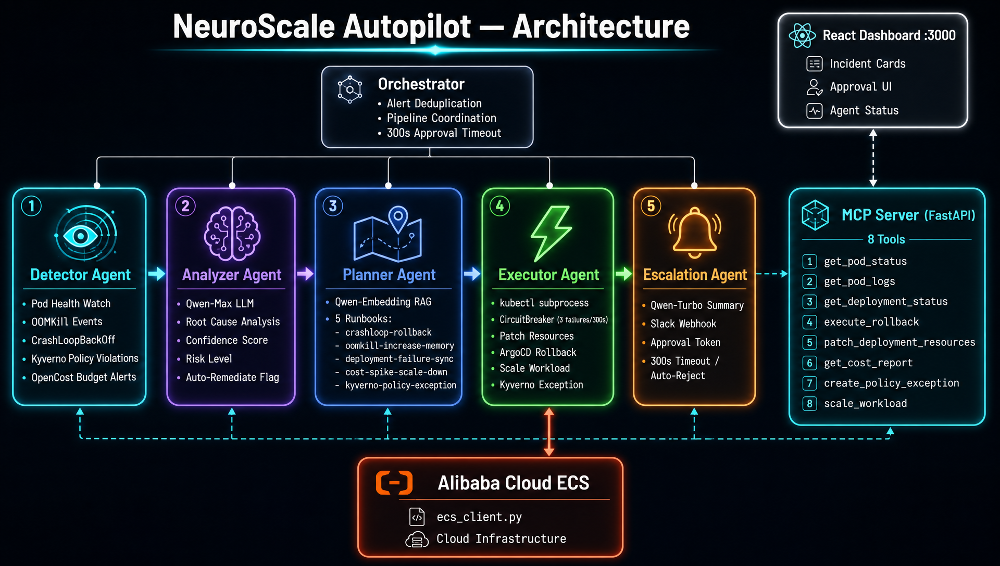
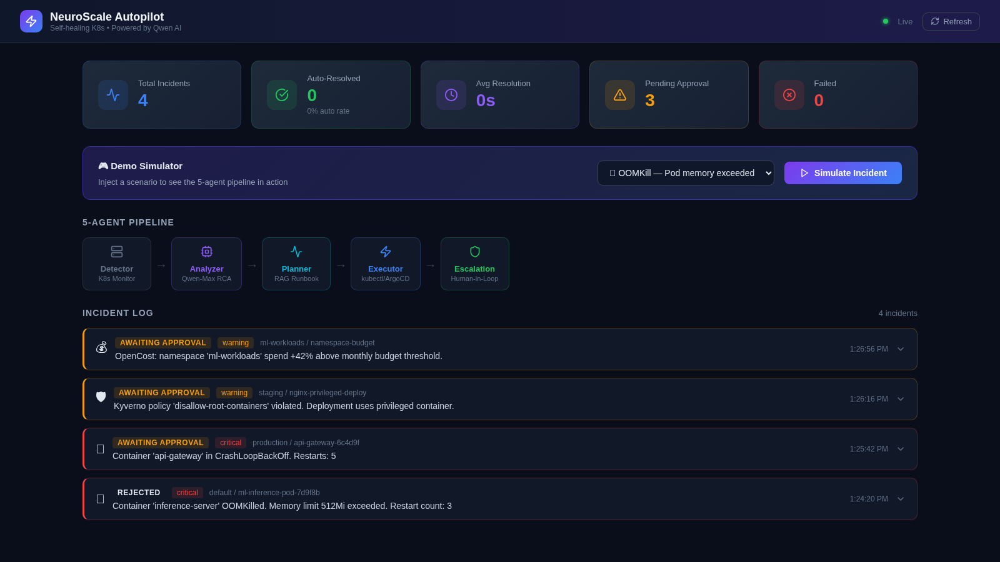
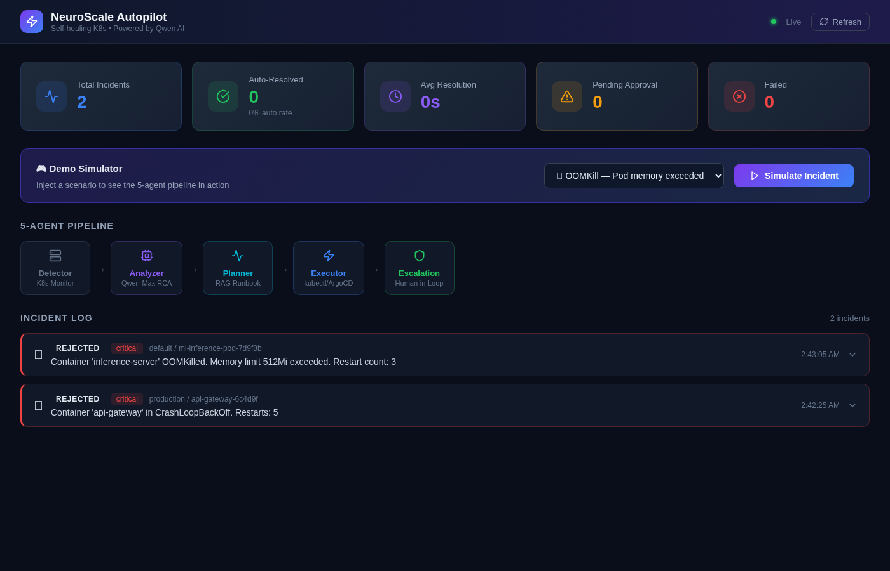
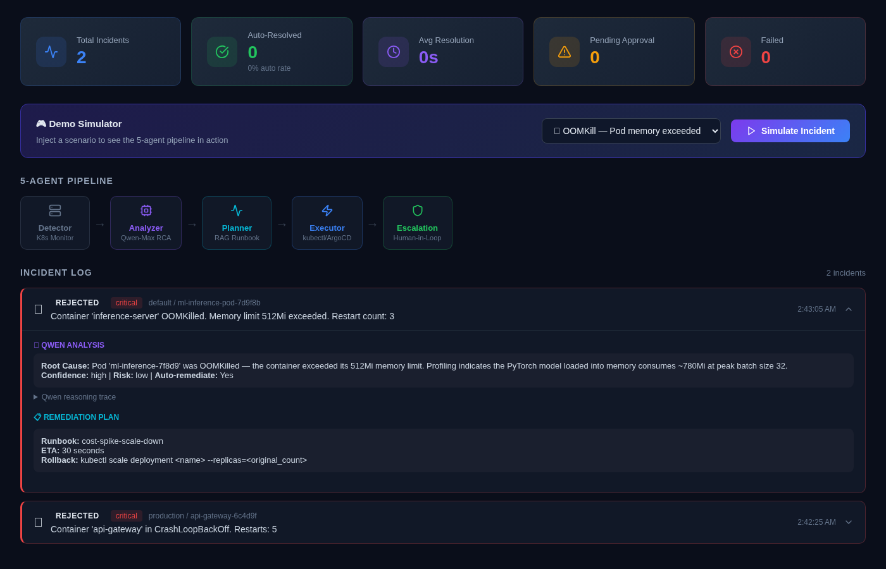

# NeuroScale Autopilot

> **Track 4 — Autopilot Agent** | Qwen Cloud Global AI Hackathon

An autonomous Kubernetes operations agent powered by the **Qwen model family**. NeuroScale Autopilot detects incidents, diagnoses root causes, plans remediations, executes fixes, and escalates to humans — all without manual intervention.

[](LICENSE)
[](https://www.python.org/)
[](https://dashscope.aliyuncs.com/)

---

## Demo Video

[](https://youtu.be/ARVD_QFKXGw)

> Click to watch the 2:44 demo — full pipeline walkthrough, Qwen models in action, MCP server, and 17/17 tests.

---

## What It Does

NeuroScale Autopilot runs a continuous self-healing loop on your Kubernetes cluster:

```
Metrics → Detect → Analyze (Qwen-Max) → Plan (Qwen-Embedding RAG) → Execute → Escalate (Qwen-Turbo)
              ↑                                                                           ↓
              └──────────────── Self-healing feedback loop ─────────────────────────────┘
```

1. **Detector** — Polls Prometheus/mock metrics; fires alerts on anomaly thresholds
2. **Analyzer** — Sends alert context to **Qwen-Max** for root cause analysis + risk scoring
3. **Planner** — Uses **Qwen-Embedding** to retrieve the most relevant runbook via semantic search; produces a structured remediation plan
4. **Executor** — Runs kubectl commands with circuit-breaker protection; dry-run by default
5. **Escalation** — **Qwen-Turbo** generates a concise Slack notification; human-in-the-loop approval for high-risk actions
6. **MCP Server** — 8 Model Context Protocol tools expose the agent to external AI clients
7. **Alibaba Cloud ECS** — Native ECS/STS client for cloud-layer remediation

---

## Architecture



> Full pipeline: Kubernetes/Kyverno/OpenCost events → 5 autonomous agents → MCP Server → Alibaba Cloud ECS. Orchestrator handles alert deduplication and human-approval timeout (300s).

<details>
<summary>ASCII fallback</summary>

```
┌──────────────────────────────────────────────────────────────┐
│                    NeuroScale Autopilot                      │
│                                                              │
│  ┌─────────┐   ┌──────────────┐   ┌──────────────────────┐  │
│  │Detector │──▶│Analyzer      │──▶│Planner               │  │
│  │         │   │Qwen-Max LLM  │   │Qwen-Embedding + RAG  │  │
│  │Prometheus│   │RCA + Scoring │   │Runbook Retrieval     │  │
│  └─────────┘   └──────────────┘   └──────────┬───────────┘  │
│                                               │              │
│  ┌─────────────────────────┐   ┌─────────────▼───────────┐  │
│  │Escalation Agent         │◀──│Executor                 │  │
│  │Qwen-Turbo Summary       │   │kubectl + Circuit Breaker│  │
│  │Slack + Approval Flow    │   │Alibaba Cloud ECS        │  │
│  └─────────────────────────┘   └─────────────────────────┘  │
│                                                              │
│  ┌─────────────────────────────────────────────────────────┐ │
│  │MCP Server (8 tools) — FastAPI REST + SSE                │ │
│  └─────────────────────────────────────────────────────────┘ │
└──────────────────────────────────────────────────────────────┘
```
</details>

---

## Dashboard Screenshots

> Real screenshots from a live running instance — captured from the actual server with simulated incidents.

**Monitoring Overview — Stat Cards + Agent Pipeline**


**Active Incident Log — 4 Incident Types**


**Expanded Incident — Qwen Analysis + Remediation Plan + Human Approval**


---

## Qwen Models Used

| Component | Model | Purpose |
|-----------|-------|---------|
| Analyzer | `qwen-max` | Root cause analysis, risk scoring, confidence |
| Planner | `text-embedding-v3` | Runbook semantic search (RAG) |
| Escalation | `qwen-turbo` | Human-readable Slack incident summaries |

All models served via **Alibaba Cloud DashScope** (`dashscope.aliyuncs.com/compatible-mode/v1`).

---

## Quick Start

### Prerequisites

- Python 3.11+
- Docker & Docker Compose (optional)
- Qwen API key from [DashScope Console](https://dashscope.aliyuncs.com/)
- `kubectl` configured (or use mock mode)

### 1. Clone & Configure

```bash
git clone https://github.com/sodiq-code/neuroscale-autopilot.git
cd neuroscale-autopilot

cp .env.example .env
# Edit .env — set your QWEN_API_KEY
```

### 2. Install & Run (Local)

```bash
pip install -r requirements.txt
python main.py
```

The agent starts in **dry-run mode** by default — no real kubectl commands are executed.

### 3. Run with Docker

```bash
docker-compose up --build
```

Services:
- `http://localhost:8000` — MCP Server API + Health
- `http://localhost:3000` — React Monitoring Dashboard

---

## Environment Variables

| Variable | Required | Default | Description |
|----------|----------|---------|-------------|
| `QWEN_API_KEY` | ✅ | — | DashScope API key |
| `QWEN_BASE_URL` | ❌ | `https://dashscope.aliyuncs.com/compatible-mode/v1` | Qwen endpoint |
| `QWEN_MODEL_MAX` | ❌ | `qwen-max` | Analyzer model |
| `QWEN_MODEL_TURBO` | ❌ | `qwen-turbo` | Escalation model |
| `QWEN_MODEL_EMBEDDING` | ❌ | `text-embedding-v3` | Embedding model |
| `SLACK_WEBHOOK_URL` | ❌ | — | Slack webhook for notifications |
| `KUBECONFIG` | ❌ | `~/.kube/config` | Kubeconfig path |
| `DRY_RUN` | ❌ | `true` | Disable real kubectl execution |
| `ALIBABA_ACCESS_KEY_ID` | ❌ | — | ECS cloud remediation |
| `ALIBABA_ACCESS_KEY_SECRET` | ❌ | — | ECS cloud remediation |
| `ALIBABA_REGION_ID` | ❌ | `cn-hangzhou` | ECS region |
| `POLL_INTERVAL_SECONDS` | ❌ | `30` | Metric polling frequency |

---

## MCP Server Tools

The MCP server exposes 8 tools for external AI clients:

| Tool | Description |
|------|-------------|
| `get_cluster_status` | Current health summary of the cluster |
| `list_active_alerts` | All active alerts with severity + age |
| `get_alert_detail` | Full detail for a specific alert |
| `trigger_remediation` | Manually trigger remediation for an alert |
| `get_remediation_status` | Status of a running remediation job |
| `approve_action` | Human approval for pending high-risk actions |
| `get_runbook` | Retrieve runbook content by name |
| `get_metrics_summary` | Raw metric summary for a namespace |

---

## Project Structure

```
neuroscale-autopilot/
├── agents/
│   ├── detector/       # Prometheus poller + alert generation
│   ├── analyzer/       # Qwen-Max RCA engine
│   ├── planner/        # Qwen-Embedding RAG + remediation planner
│   ├── executor/       # kubectl runner + circuit breaker
│   └── escalation/     # Qwen-Turbo + Slack + approval flow
├── mcp_server/         # FastAPI MCP server (8 tools)
├── alibaba_cloud/      # ECS/STS client for cloud remediation
├── dashboard/          # React monitoring dashboard
├── runbooks/           # Markdown runbooks for RAG
├── k8s/                # Kubernetes manifests (deploy to ECS K8s)
├── tests/              # Pytest smoke + integration tests
├── .github/workflows/  # CI pipeline
├── main.py             # Entry point
├── Dockerfile
└── docker-compose.yml
```

---

## Alibaba Cloud Deployment

Deploy to Alibaba Cloud Container Service for Kubernetes (ACK):

```bash
# Apply namespace + RBAC
kubectl apply -f k8s/namespace.yaml
kubectl apply -f k8s/rbac.yaml

# Create secret with your API key
kubectl create secret generic neuroscale-secrets \
  --from-literal=QWEN_API_KEY=<your-key> \
  -n neuroscale-autopilot

# Deploy
kubectl apply -f k8s/deployment.yaml
kubectl apply -f k8s/service.yaml
```

---

## How the Self-Healing Loop Works

```
1. Detector polls Prometheus every 30s
2. Anomaly detected → Alert fired (severity: info/warning/critical)
3. Analyzer sends alert to Qwen-Max → returns RCA + risk score
4. Planner embeds RCA with text-embedding-v3 → finds closest runbook
5. Planner builds RemediationPlan (steps + requires_approval flag)
6. If requires_approval=True:
     → Qwen-Turbo generates summary → Slack notification sent
     → System waits up to 5 min for human approval
     → Auto-rejects on timeout (safety-first)
7. If approved (or auto-approved):
     → Executor runs kubectl steps with circuit breaker
     → On consecutive failures → breaker OPEN → no more attempts
8. Result logged → Detector re-polls → loop continues
```

---

## License

MIT — see [LICENSE](LICENSE)

---

## Author

**Sodiq Jimoh** — DevOps / Cloud Engineer  
[LinkedIn](https://linkedin.com/in/sodiq-jimoh-afsod)

Built for the **Qwen Cloud Global AI Hackathon — Track 4: Autopilot Agent**
