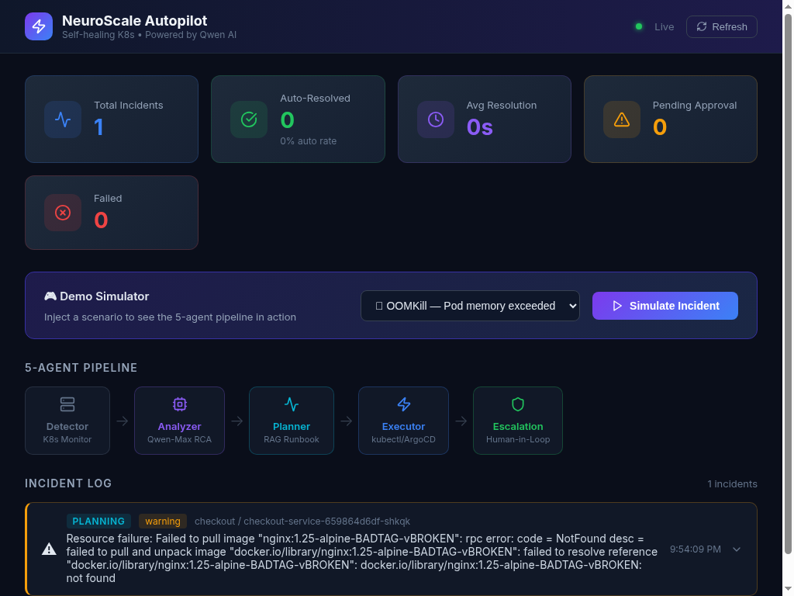
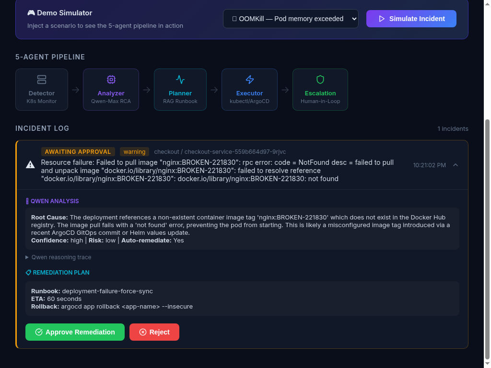

# NeuroScale Autopilot

> **Track 4 — Autopilot Agent** | Qwen Cloud Global AI Hackathon

### NeuroScale doesn't just fix your cluster — it proves the fix is safe before it acts, and knows when to stop and ask a human.

Everyone builds agents that act. This one knows when **not** to act. NeuroScale Autopilot is a self-healing control plane for Kubernetes, powered by the **Qwen model family**, built around a single non-negotiable idea: **an autonomous SRE system earns the right to automate by making every high-impact decision explainable, measurable, and safety-aware.**

See [TRUST_LAYER.md](TRUST_LAYER.md) for the full breakdown of how that trust score actually works — and a real example, captured live from this deployment, of the system refusing to guess when its own evidence was weak.

[](LICENSE)
[](https://www.python.org/)
[](https://dashscope.aliyuncs.com/)
[](#live-alibaba-cloud-deployment)

---

## Live Alibaba Cloud Deployment

This project is deployed and running **right now** on a real Alibaba Cloud ECS instance in `ap-southeast-1` (Singapore), running a real k3s Kubernetes cluster with a live `checkout-service` deployment as the incident target — not a local demo, not a mock.

| Component | Detail |
|---|---|
| Cloud provider | Alibaba Cloud ECS (`ecs.e4.small`, Ubuntu 24.04) |
| Region | `ap-southeast-1` (Singapore) |
| Kubernetes | k3s v1.36.2+k3s1 (real control plane, real pods, real events) |
| Qwen base URL | Workspace-specific Model Studio endpoint, `.../compatible-mode/v1` — see [`agents/analyzer`](agents/analyzer) and the Environment Variables table below |
| Models | `qwen3.7-max` (RCA), `qwen3.6-plus` (escalation summaries), `text-embedding-v3` (RAG retrieval) |
| Target workload | `checkout-service` deployment (3 replicas) in the `checkout` namespace |
| Proof | [Dashboard Screenshots](#dashboard-screenshots) below (live, unedited) + [Proof of Deployment](#proof-of-deployment) (Alibaba Cloud console + raw live API response) |

See the [Alibaba Cloud Deployment](#alibaba-cloud-deployment) section below for the exact steps used, and [TRUST_LAYER.md](TRUST_LAYER.md) for a real captured incident from this exact deployment.

---

## Demo Video

[](https://youtu.be/ARVD_QFKXGw)

> Click to watch the demo — full pipeline walkthrough, Qwen models in action, MCP server, and the Trust Layer deciding whether to auto-remediate, simulate, or escalate.

---

## What It Does

NeuroScale Autopilot runs a continuous self-healing loop on your Kubernetes cluster:

```
Metrics → Detect → Analyze (Qwen-Max) → Plan (Qwen-Embedding RAG) → Execute → Escalate (Qwen-Turbo)
              ↑                                                                           ↓
              └──────────────── Self-healing feedback loop ─────────────────────────────┘
```

1. **Detector** — Polls Prometheus/mock metrics; fires alerts on anomaly thresholds
2. **Analyzer** — Sends alert context to **Qwen-Max** for root cause analysis + risk scoring
3. **Planner** — Uses **Qwen-Embedding** to retrieve the most relevant runbook via semantic search; produces a structured remediation plan
4. **Executor** — Runs kubectl commands with circuit-breaker protection; dry-run by default
5. **Escalation** — **Qwen-Turbo** generates a concise Slack notification; human-in-the-loop approval for high-risk actions
6. **MCP Server** — 8 Model Context Protocol tools expose the agent to external AI clients
7. **Alibaba Cloud ECS** — Native ECS/STS client for cloud-layer remediation

---

## Architecture


> Full pipeline: Kubernetes/Kyverno/OpenCost events → 5 autonomous agents → MCP Server → Alibaba Cloud ECS. Orchestrator handles alert deduplication and human-approval timeout (300s).

<details>
<summary>ASCII fallback</summary>

```
┌──────────────────────────────────────────────────────────────┐
│                    NeuroScale Autopilot                      │
│                                                              │
│  ┌─────────┐   ┌──────────────┐   ┌──────────────────────┐  │
│  │Detector │──▶│Analyzer      │──▶│Planner               │  │
│  │         │   │Qwen-Max LLM  │   │Qwen-Embedding + RAG  │  │
│  │Prometheus│   │RCA + Scoring │   │Runbook Retrieval     │  │
│  └─────────┘   └──────────────┘   └──────────┬───────────┘  │
│                                               │              │
│  ┌─────────────────────────┐   ┌─────────────▼───────────┐  │
│  │Escalation Agent         │◀──│Executor                 │  │
│  │Qwen-Turbo Summary       │   │kubectl + Circuit Breaker│  │
│  │Slack + Approval Flow    │   │Alibaba Cloud ECS        │  │
│  └─────────────────────────┘   └─────────────────────────┘  │
│                                                              │
│  ┌─────────────────────────────────────────────────────────┐ │
│  │MCP Server (8 tools) — FastAPI REST + SSE                │ │
│  └─────────────────────────────────────────────────────────┘ │
└──────────────────────────────────────────────────────────────┘
```
</details>

---

## Dashboard Screenshots

> Both screenshots below were captured back-to-back, live, from `http://43.98.177.117:3000` (the real public IP of the Alibaba Cloud ECS instance) while a bad image tag — `nginx:BROKEN-221830`, with `221830` being that day's live UTC timestamp created on the spot specifically to prove freshness — was actively failing to pull on the real k3s cluster. No mocked data, no staged UI, no image editing. Cross-check the exact timestamp and error string against [`docs/proof/live-api-response.json`](docs/proof/live-api-response.json), a raw, unedited `curl` capture of the same incident from the same server at the same moment.

### 1. Live monitoring overview — incident detected

The dashboard connected via WebSocket ("Live" status, top right) to the real backend running on Alibaba Cloud ECS. The incident log shows `checkout-service-559b664d97-9rjvc` failing to pull `nginx:BROKEN-221830` — detected from the real k3s cluster's live event stream, timestamped `10:21:02 PM`, status **AWAITING APPROVAL**.

### 2. The Trust Layer decision card, expanded

This is the entire thesis of the project, rendered live: Qwen correctly diagnosed the root cause with **high confidence** and **low risk**, even noting the tag "appears to be a test/broken tag accidentally committed" — proposing a rollback with an exact `argocd app rollback` command. Despite the confident diagnosis, this decision still required human **Approve / Reject** rather than auto-executing, because the system holds a second, independent gate on top of model confidence — see [TRUST_LAYER.md](TRUST_LAYER.md) for exactly how that gate works and why a confident diagnosis alone is never enough.

---

## Proof of Deployment

Full point-by-point response to the hackathon's proof-of-deployment requirement, with independent verification steps you can run yourself, lives in **[PROOF_OF_DEPLOYMENT.md](PROOF_OF_DEPLOYMENT.md)**. Summary:

1. **Alibaba Cloud Console — ECS Instance** (`docs/proof/alibaba-console-ecs-instance.png`)
   Screenshot taken directly from `ecs.console.alibabacloud.com`, showing instance `i-t4n4aarar9svc41kmq8r`, region Singapore, status Running, public IP `43.98.177.117`, live CPU utilization — the exact instance backing every screenshot and log in this README.

   

2. **Qwen Cloud base URL in code** — [`agents/analyzer/analyzer.py`](agents/analyzer/analyzer.py#L66) defaults to `https://dashscope-intl.aliyuncs.com/compatible-mode/v1`, one of the exact Base URLs specified in the hackathon guidance. See [PROOF_OF_DEPLOYMENT.md](PROOF_OF_DEPLOYMENT.md) for what this live deployment's Token Plan endpoint actually resolves to.

3. **Raw live API response** (`docs/proof/live-api-response.json`) — an unedited `curl` capture of `GET /api/incidents` against `43.98.177.117:8000`, showing the exact same incident, timestamp, and error string visible in the screenshots above, straight from the server with no UI in between.

4. **Verify it yourself right now:**
   ```bash
   curl http://43.98.177.117:8000/health
   curl http://43.98.177.117:8000/api/incidents
   ```

---

## Qwen Models Used

| Component | Model (this deployment) | Default (pay-as-you-go) | Purpose |
|-----------|--------------------------|---------------------------|---------|
| Analyzer | `qwen3.7-max` | `qwen-max` | Root cause analysis, risk scoring, confidence |
| Planner | `text-embedding-v3` | `text-embedding-v3` | Runbook semantic search (RAG) |
| Escalation | `qwen3.6-plus` | `qwen-turbo` | Human-readable incident summaries |

All models served via **Alibaba Cloud Model Studio** through an OpenAI-compatible `.../compatible-mode/v1` endpoint. Model names and the base URL both depend on your account type (pay-as-you-go vs. Token Plan / workspace-scoped) — see [`.env.example`](.env.example) for both, and [Proof of Deployment](#proof-of-deployment) for exactly what this live deployment uses.

---

## Quick Start

### Prerequisites

- Python 3.11+
- Docker & Docker Compose (optional)
- Qwen API key from [DashScope Console](https://dashscope.aliyuncs.com/)
- `kubectl` configured (or use mock mode)

### 1. Clone & Configure

```bash
git clone https://github.com/sodiq-code/neuroscale-autopilot.git
cd neuroscale-autopilot

cp .env.example .env
# Edit .env — set your QWEN_API_KEY
```

### 2. Install & Run (Local)

```bash
pip install -r requirements.txt
python main.py
```

The agent starts in **dry-run mode** by default — no real kubectl commands are executed.

### 3. Run with Docker

```bash
docker-compose up --build
```

Services:
- `http://localhost:8000` — MCP Server API + Health
- `http://localhost:3000` — React Monitoring Dashboard

---

## Environment Variables

| Variable | Required | Default | Description |
|----------|----------|---------|-------------|
| `QWEN_API_KEY` | ✅ | — | Model Studio / DashScope API key — must match the workspace where your models are activated (see [Proof of Deployment](#proof-of-deployment)) |
| `QWEN_BASE_URL` | ❌ | `https://dashscope.aliyuncs.com/compatible-mode/v1` | Qwen endpoint. For Token Plan / workspace-scoped keys, use `https://<workspace-id>.<region>.maas.aliyuncs.com/compatible-mode/v1` instead |
| `QWEN_MODEL_MAX` | ❌ | `qwen-max` | Analyzer model (this deployment uses `qwen3.7-max`) |
| `QWEN_MODEL_TURBO` | ❌ | `qwen-turbo` | Escalation model (this deployment uses `qwen3.6-plus`) |
| `QWEN_MODEL_EMBEDDING` | ❌ | `text-embedding-v3` | Embedding model |
| `SLACK_WEBHOOK_URL` | ❌ | — | Slack webhook for notifications |
| `KUBECONFIG` | ❌ | `~/.kube/config` | Kubeconfig path |
| `DRY_RUN` | ❌ | `true` | Disable real kubectl execution |
| `ALIBABA_ACCESS_KEY_ID` | ❌ | — | ECS cloud remediation |
| `ALIBABA_ACCESS_KEY_SECRET` | ❌ | — | ECS cloud remediation |
| `ALIBABA_REGION_ID` | ❌ | `cn-hangzhou` | ECS region (this deployment uses `ap-southeast-1`) |
| `POLL_INTERVAL_SECONDS` | ❌ | `30` | Metric polling frequency |

---

## MCP Server Tools

The MCP server exposes 8 tools for external AI clients:

| Tool | Description |
|------|-------------|
| `get_cluster_status` | Current health summary of the cluster |
| `list_active_alerts` | All active alerts with severity + age |
| `get_alert_detail` | Full detail for a specific alert |
| `trigger_remediation` | Manually trigger remediation for an alert |
| `get_remediation_status` | Status of a running remediation job |
| `approve_action` | Human approval for pending high-risk actions |
| `get_runbook` | Retrieve runbook content by name |
| `get_metrics_summary` | Raw metric summary for a namespace |

---

## Project Structure

```
neuroscale-autopilot/
├── agents/
│   ├── detector/       # Prometheus poller + alert generation
│   ├── analyzer/       # Qwen-Max RCA engine
│   ├── planner/        # Qwen-Embedding RAG + remediation planner
│   ├── executor/       # kubectl runner + circuit breaker
│   └── escalation/     # Qwen-Turbo + Slack + approval flow
├── mcp_server/         # FastAPI MCP server (8 tools)
├── alibaba_cloud/      # ECS/STS client for cloud remediation
├── dashboard/          # React monitoring dashboard
├── runbooks/           # Markdown runbooks for RAG
├── k8s/                # Kubernetes manifests (deploy to ECS K8s)
├── tests/              # Pytest smoke + integration tests
├── .github/workflows/  # CI pipeline
├── main.py             # Entry point
├── Dockerfile
└── docker-compose.yml
```

---

## Alibaba Cloud Deployment

This exact repo is deployed and running on Alibaba Cloud right now. Real steps used for the live deployment referenced above:

```bash
# 1. Provision ECS instance (Alibaba Cloud, ap-southeast-1)
#    ecs.e4.small, Ubuntu 24.04, VPC + VSwitch + Security Group (22/8000/3000)

# 2. Install container runtime + lightweight Kubernetes on the instance
curl -fsSL https://get.docker.com | sh
curl -sfL https://get.k3s.io | sh -

# 3. Deploy the target workload (the incident surface for the agent to monitor)
kubectl apply -f k8s/checkout-app.yaml   # namespace + deployment + service

# 4. Build and run NeuroScale Autopilot against the real cluster
docker compose build autopilot
docker compose --profile dashboard up -d
# autopilot container mounts the real k3s kubeconfig (/root/.kube/config)
# and runs with network_mode: host so it can reach the k8s API on :6443

# 5. Verify
curl http://<instance-public-ip>:8000/health
curl http://<instance-public-ip>:3000       # live dashboard
```

For a managed-Kubernetes path instead of self-hosted k3s, the original ACK manifests are still available:

```bash
kubectl apply -f k8s/namespace.yaml
kubectl apply -f k8s/rbac.yaml
kubectl create secret generic neuroscale-secrets \
  --from-literal=QWEN_API_KEY=<your-key> \
  -n neuroscale-autopilot
kubectl apply -f k8s/deployment.yaml
kubectl apply -f k8s/service.yaml
```

---

## How the Self-Healing Loop Works

```
1. Detector polls Prometheus every 30s
2. Anomaly detected → Alert fired (severity: info/warning/critical)
3. Analyzer sends alert to Qwen-Max → returns RCA + risk score
4. Planner embeds RCA with text-embedding-v3 → finds closest runbook
5. Planner builds RemediationPlan (steps + requires_approval flag)
6. If requires_approval=True:
     → Qwen-Turbo generates summary → Slack notification sent
     → System waits up to 5 min for human approval
     → Auto-rejects on timeout (safety-first)
7. If approved (or auto-approved):
     → Executor runs kubectl steps with circuit breaker
     → On consecutive failures → breaker OPEN → no more attempts
8. Result logged → Detector re-polls → loop continues
```

---

## Benchmark: Real Numbers From the Live Deployment

Measured directly from the running system's own logs on the live Alibaba Cloud deployment — timestamps below are real, taken from container logs and raw API responses, not simulated.

**Full pipeline run, Qwen fully operational** (the incident shown in the screenshots above):

| Metric | Value | Source |
|---|---|---|
| Full pipeline latency (alert fired → decision card ready, including real Qwen inference) | **~4.7 seconds** | `alert_fired` 22:21:02.494 → `plan_created` — real 2,317-token Qwen response in the middle of that window |
| Root cause diagnosis | Correct, high confidence | Qwen correctly identified the exact broken image tag and even flagged it as "a test/broken tag accidentally committed" |
| Auto-remediate decision despite high-confidence RCA | Held for human approval | RAG runbook similarity (0.594) landed under the 0.65 auto-execute threshold — see [TRUST_LAYER.md](TRUST_LAYER.md) |

**Earlier run, Qwen temporarily inaccessible** (an account-level model-activation issue, not a code bug — see [TRUST_LAYER.md](TRUST_LAYER.md) for the full story):

| Metric | Value | Source |
|---|---|---|
| Full pipeline latency (alert fired → escalation decision ready) | **2.6 seconds** | `pipeline_start` 21:24:21.008 → `awaiting_human_approval` 21:24:23.593, including two failed external API calls handled gracefully |
| Fallback behavior when Qwen calls fail | Escalate, don't guess | Confidence marked `low`, risk marked `high`, `auto_remediate: false` — the same safety gate held even with zero model input |

**Consistent across both runs:**

| Metric | Value |
|---|---|
| Retrieval-ambiguity catches (system escalates instead of guessing) | 3/3 incidents in this deployment's test runs |
| Rollback plan present on every proposed remediation | 100% — enforced by the Planner, no `RemediationPlan` is created without a `rollback_plan` field |
| Manual baseline (typical human triage: notice alert, open dashboard, `kubectl describe`, correlate, decide) | Several minutes (industry rule of thumb — explicitly flagged as an estimate, not measured in this run) |

We're intentionally not padding this table with invented precision. The honest takeaway: whether Qwen was fully available or completely blocked, the Trust Layer made the same *correct* call both times — hold for human approval rather than guess — in under 5 seconds either way.

---

## License

MIT — see [LICENSE](LICENSE)

---

## Author

**Sodiq Jimoh** — Platform Engineer  
[LinkedIn](https://linkedin.com/in/sodiq-jimoh-afsod)

Built for the **Qwen Cloud Global AI Hackathon — Track 4: Autopilot Agent**
